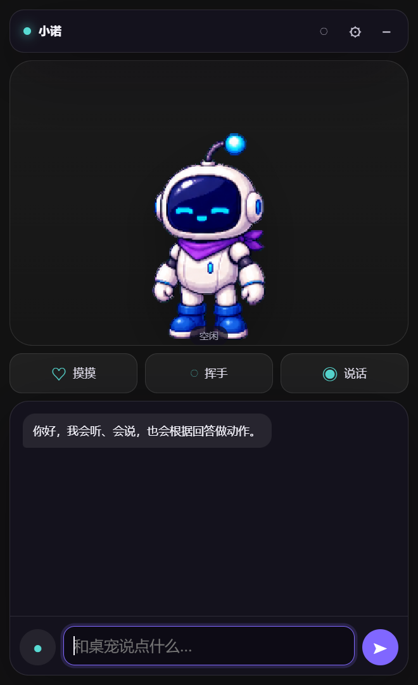
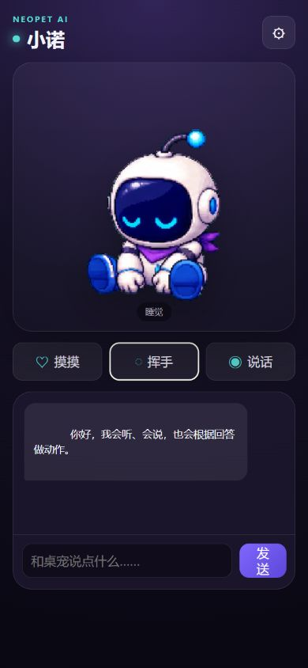

# NeoPet AI 桌面端与移动端

NeoPet AI 是一个跨电脑与移动设备的 AI 宠物。电脑端提供透明置顶桌宠，移动端提供可安装 PWA；两端都可连接 OpenAI 兼容 API，也可以把 API 地址改成本机 `llama-server` 等兼容服务。


## 0.3.0 长期陪伴记忆

电脑版、PWA 与 Android 现在都具备本地长期记忆、关系成长、心情与连续陪伴天数、陪伴日记和主动问候。用户可查看并单独删除宠物记住的事情，也可导出 JSON 备份、导入恢复或彻底清除陪伴数据；API 密钥不会写入备份文件。记忆会作为受控上下文提供给自由选择的聊天模型，使宠物自然延续之前的相处内容。

## 0.4.0 本地 AI 运行时

Windows 版支持 Whisper Tiny 离线语音识别、Ollama + Gemma 3 1B 离线聊天和 pyttsx3 本地朗读。Kokoro 已预留独立提供器位置，并在尚未安装时安全回退到系统朗读。设置中的“检测本地组件”分别显示四个组件的状态。

普通用户可在设置中点击“应用内安装离线套件”；它会明确提示约 2.4GB 空间后，再从官方来源安装各组件。开发机也可运行：`powershell -ExecutionPolicy Bypass -File scripts/install-local-runtime.ps1`。

设计与质量文档：[架构](docs/ARCHITECTURE.md) · [性能](docs/PERFORMANCE.md) · [安全](docs/SECURITY.md) · [测试](docs/TESTING.md)

## 0.2.0 多宠物与 3D

电脑版和移动版现在使用同一套角色比例、动作状态、快捷操作和视觉语言。电脑端保留适合工作的透明悬浮模式，展开后与移动端使用相同的宠物舞台、`摸摸 / 挥手 / 说话`入口和聊天卡片；平台差异只保留在窗口形态，不再把两端做成两个不同产品。

| Windows 悬浮模式 | Windows 展开模式 | 移动端 |
| --- | --- | --- |
|  |  |  |

设计参考与取舍见 [产品参考研究](docs/DESIGN_REFERENCES.md)。

## 移动端

移动端源码在 `mobile/`，可安装到 Android、iPhone、iPad 和支持 PWA 的桌面浏览器。内置小诺、云团、月狸三只动作宠物，也可导入本地或网络 GLB/GLTF 真 3D 模型。

```powershell
npm run mobile:serve
```

打开 `http://127.0.0.1:4173`。移动版包括自适应宠物、触摸互动、闲置动作、语音输入与朗读、自由模型配置、自定义图片和离线应用外壳。Android 原生悬浮层与 iOS WidgetKit 是平台增强层，不属于网页权限范围。

Android 工程位于 `android/`，打包时直接复用 `mobile/` 的页面资源。调试 APK 可通过 Android Studio 构建，或使用仓库内 Gradle Wrapper 执行 `android\\gradlew.bat -p android assembleDebug`。

### Android 悬浮桌宠与权限

Android APK 会在顶部显示“悬浮授权 / 开启悬浮 / 关闭悬浮”按钮，PWA 和 iPhone 不显示该按钮。权限遵循按需申请：

- `INTERNET`：连接云端 API 或局域网本地模型，安装时自动授予。
- `RECORD_AUDIO`：只有用户主动使用语音输入时才申请；拒绝后仍可文字聊天。
- `SYSTEM_ALERT_WINDOW`：只有用户主动开启悬浮桌宠时才跳转系统设置授权。
- `POST_NOTIFICATIONS`：开启悬浮桌宠时申请，用于显示可见的常驻控制通知；拒绝后 Android 仍会在系统任务管理界面显示前台服务状态。
- `FOREGROUND_SERVICE` 与 `FOREGROUND_SERVICE_SPECIAL_USE`：用于维持用户主动开启的互动桌宠，服务用途已在清单中声明。

悬浮宠物支持拖动、点击动作反馈、语音入口和返回完整聊天；通知中始终提供“关闭桌宠”。选择宠物图片或 3D 模型继续使用系统文件选择器，不申请读取全部存储空间。当前没有启用视频通话，因此不会提前申请摄像头权限。

## 桌面宠物交互

- 登录成功后默认进入透明宠物模式，不持续占用大聊天窗口。
- 默认宠物“小诺”使用 8×11、共 88 格的 v2 动作图集；包含九类标准动作和 16 向鼠标注视，按实际显示尺寸逐帧校验。
- 拖动宠物可移动位置；单击互动；双击展开聊天；右键打开设置。
- 宠物闲置时会随机挥手、点头、活动或跳舞，长时间无操作后睡觉。
- 倾听、思考和回答具有不同动作，语音回答期间带口型动画。
- `Ctrl+Shift+Space` 或系统托盘菜单可随时打开完整聊天面板。

## 已实现

- 邮箱验证码登录，验证码 5 分钟有效，60 秒发送限流，最多尝试 5 次。
- Windows 透明置顶窗口、系统托盘、全局快捷键和鼠标穿透。
- 完整与精简两种窗口模式，宠物可直接拖动。
- 空闲、左右移动、聆听、思考、说话、开心、挥手、点头、跳舞和睡眠动作。
- 鼠标在宠物周围移动时，眼睛和天线会按 16 个方向连续跟随。
- AI 回答返回情绪及动作，语音朗读时同步口型和对应动作。
- OpenAI 兼容聊天 API，可自由填写服务地址和模型名称。
- 本地兼容服务可以不填写 API 密钥；云端服务按供应商要求填写。
- API 密钥使用 Electron `safeStorage` 和操作系统凭据能力加密保存。
- 系统语音朗读、语速和声音选择；支持时启用系统语音识别。
- 可指定中文、英语、日语、韩语，或跟随输入自动识别。
- AI 生成原创宠物，或导入 PNG、WebP、JPG 图片。
- 小诺、云团、月狸三只内置动作宠物；电脑端、PWA 与 Android 悬浮层同步选择。
- 导入本地或网络 GLB/GLTF 真 3D 宠物，支持触摸旋转和模型自带动画。
- 视频中心可载入本地视频、按当前时间添加弹幕、根据字幕用 AI 批量生成弹幕、翻译字幕并导出 VTT。
- 视频通话入口会先测试摄像头和麦克风，再创建可分享的加密 Jitsi 会议链接；摄像头权限只在用户点击测试时申请。
- 最近 30 条对话记忆、角色名字和性格设置。
- 可查看和单条遗忘的长期记忆、关系等级、心情、连续陪伴天数、陪伴日记与主动问候。
- 本地陪伴数据可备份、导入和彻底清除，备份不包含 API 密钥。
- Windows 安装包、便携版和 Android 调试 APK；代码保留 macOS DMG 与 Linux AppImage 配置。

## 开发运行

```powershell
npm install
npm test
npm start
```

开发环境默认直接显示测试验证码，不会连接真实 SMTP；需要在开发环境实际发送邮件时额外设置 `NEOPET_DEV_SEND_EMAIL=1`。正式安装包仍按 SMTP 配置发送邮件，不会显示开发验证码。

## 邮箱验证码

当前个人测试可使用 QQ 邮箱 SMTP。启动前设置：

```powershell
$env:NEOPET_SMTP_HOST='smtp.qq.com'
$env:NEOPET_SMTP_PORT='465'
$env:NEOPET_SMTP_USER='发件邮箱'
$env:NEOPET_SMTP_PASS='QQ邮箱SMTP授权码'
$env:NEOPET_ALLOWED_EMAILS='可选测试白名单，多个邮箱用逗号分隔'
npm start
```

`NEOPET_SMTP_PASS` 使用 SMTP 授权码，不是邮箱登录密码。未设置 `NEOPET_ALLOWED_EMAILS` 时允许任何格式有效的邮箱请求验证码。面向公众发布时应把验证码发送和账号会话迁移到服务端，不能把 SMTP 凭据分发到客户端。

## AI 设置

打开设置后填写：

- API 地址，例如 `https://api.openai.com/v1`，也可以填写本机兼容服务地址。
- 聊天模型名称。
- 图像模型名称，仅生成宠物时需要。
- API 密钥。

聊天接口使用 `/chat/completions`，图像生成使用 `/images/generations`。不同服务商支持的模型和图像参数可能不同。

## Windows 快捷操作

- `Ctrl+Shift+Space`：显示桌宠并打开聊天。
- 点击宠物：摸头互动。
- 拖动宠物：移动整个桌宠窗口。
- 托盘菜单：显示、打开聊天、鼠标穿透或退出。

## 构建

```powershell
npm run pack:win
```

输出位于 `dist`：

- NSIS 安装程序。
- Windows 便携版。

## 产品边界

- 电影和动画可作为风格、色彩和氛围灵感，但不应直接复制受版权保护的角色造型、名称或声音。
- 当前记忆保存在本机。多设备同步需要后续账号服务。
- Windows 是首个验证平台；macOS 和 Linux 需要在对应系统上完成签名、权限和打包验证。
